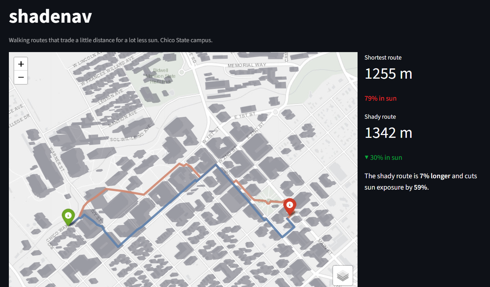
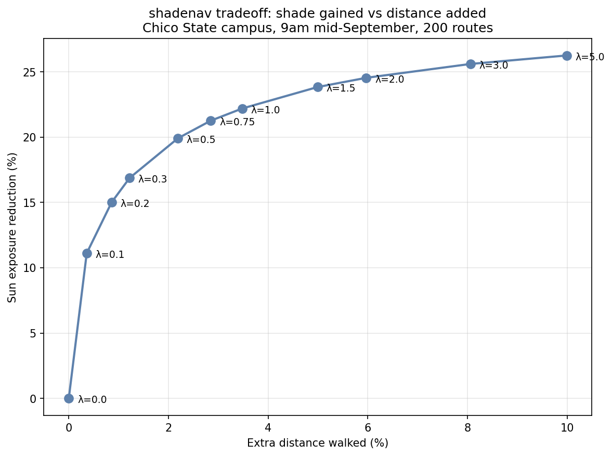

# shadenav

**Shade-aware pedestrian routing.** Walking directions that trade a little extra distance for a lot less time in direct sun — with a tunable dial for how much you care about shade.

Testbed: the California State University, Chico campus and surrounding blocks.

**Live demo:** https://shadenav.streamlit.app *(free tier — may take ~30s to wake on first visit)*



---

## Why

Walking apps route you the *shortest* way. On a hot, sunny day, the shortest way is often the most miserable way. shadenav computes where building shadows fall at a given date and time, scores every street by how much of it is in sun, and finds routes that keep you in the shade — letting you decide how much of a detour that's worth. Click two points on the map, or drag the time-of-day and shade-preference sliders to see the route change live.

## How it works

1. **Data** — street network and building footprints from OpenStreetMap, projected to UTM Zone 10N (metres). Building heights from OSM tags where available, with a documented fallback (see *Data honesty* below).
2. **Shadows** — for a given date and time, the sun's position (via `pvlib`) is used to cast each building's footprint into a ground shadow, and all shadows are unioned into one shape.
3. **Scoring** — each street segment is sampled every ~10 m; the fraction of sample points falling inside shadow becomes that segment's shade score.
4. **Routing** — a modified shortest-path where each segment's cost is `length × (1 + λ × sun_fraction)`. The preference dial **λ** blends distance against sun exposure: λ=0 is the plain shortest path; higher λ accepts longer detours for shade.

## Findings

Validated over **200 random walks** across the study area, at 9am mid-September, sweeping λ from 0 to 5. Each route's extra distance and sun reduction are measured against its own shortest path.



| λ | Extra distance | Sun reduction |
|-----|----------------|---------------|
| 0.1 | ~0.4% | ~11% |
| 0.3 | ~1.2% | ~17% |
| 0.5 | ~2.2% | ~20% |
| 5.0 | ~10% | ~26% |

**A very mild shade preference pays off disproportionately:** λ=0.1 cuts sun exposure by ~11% for essentially no extra walking. The efficient range is λ≈0.1–0.5. Beyond that, returns diminish sharply toward a ceiling of ~26%.

That ceiling is a *data* limit, not a method limit — see below.

## Data honesty

- Only **~11% of buildings by count** have real height data (OSM tags or floor counts); the rest use a documented 6 m default.
- Weighted by what matters for shadows, coverage is better: **~35% by footprint area** and **~42% by building volume**. The buildings with real data are disproportionately the large, tall ones that dominate shading.

Because most buildings fall back to a stubby 6 m default, their shadows are short — which is why the sun-reduction ceiling sits around 26%. **Replacing OSM heights with LiDAR-measured heights (and adding tree canopy) is expected to raise that ceiling**, and the validation script (`scripts/validate.py`) is built to quantify exactly how much, by re-running with `--tag lidar --overlay osm`.

Other limitations: trees are not yet modelled; buildings are treated as solid blocks; the OSM building set is incomplete, so unmapped buildings cast no shadow.

## Running it

```bash
git clone https://github.com/Prabin-Hasham/shadenav.git
cd shadenav
pip install -r requirements.txt
streamlit run app.py
```

Re-running the validation experiment:

```bash
python scripts/validate.py --tag osm
```

## Roadmap

- **LiDAR heights + tree canopy** (in progress — raw data sourced, see below).
- **Address search** as an alternative to clicking the map.

---

# Raw LiDAR data

Raw `.laz` files are stored in the shared Google Drive folder:
`https://drive.google.com/drive/folders/1-WG9JCL5mNaPOwBi4sA6wZaXAoA2U2wM?usp=drive_link`

Source: USGS 3DEP LidarExplorer
Study area: Chico, California
Downloaded: September 2026

Coverage is assembled from:
- CA FEMA R9 Keefer 2017
- CA NoCAL Wildfires B2 2018
- CA NoCAL Wildfires CampFire 2018
- CA SierraNevada 1 2022

Raw LiDAR files are intentionally excluded from GitHub.
